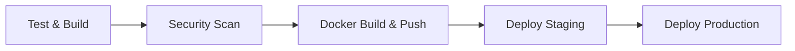

# Guia de Deploy - JWT Validator API

## Visão Geral

Este guia abrange todas as opções de deployment da JWT Validator API, desde execução local até deployment em produção
com CI/CD automatizado.

## Deployment Local

### Docker Compose (Recomendado)

#### Produção Local

```bash
# Build e execução
docker-compose up --build

# Em background
docker-compose up -d --build

# Parar
docker-compose down
```

#### Desenvolvimento

```bash
# Modo desenvolvimento com hot reload
docker-compose --profile dev up

# Com rebuild
docker-compose --profile dev up --build
```

### Docker Standalone

```bash
# 1. Build da imagem
docker build -t jwt-validator .

# 2. Executar container
docker run -p 8080:8080 jwt-validator

# 3. Com variáveis de ambiente
docker run -p 8080:8080 \
  -e JWT_SECRET=seu-secret-aqui \
  -e SERVER_PORT=8080 \
  jwt-validator

# 4. Em background
docker run -d -p 8080:8080 --name jwt-validator jwt-validator
```

### Usando Imagem do Registry

```bash
# GitHub Container Registry
docker run -p 8080:8080 ghcr.io/seu-usuario/jwt-validator:latest

# Docker Hub (se configurado)
docker run -p 8080:8080 seu-usuario/jwt-validator:latest
```

## CI/CD Pipeline

### Arquitetura do Pipeline

O projeto implementa um pipeline completo usando **GitHub Actions** com 5 jobs principais:



### Jobs do Pipeline

#### 1. **Test and Build**

- ✅ Executa testes unitários e de integração
- ✅ Gera relatórios JUnit e Jacoco
- ✅ Constrói artefato JAR
- ✅ Cache inteligente do Maven

#### 2. **Security Scan**

- 🔒 OWASP Dependency Check
- 🔒 Verificação de vulnerabilidades
- 🔒 Relatórios de segurança

#### 3. **Build and Push Docker Image**

- 🐳 Build da imagem Docker
- 🐳 Push para GitHub Container Registry
- 🐳 Tags automáticas (branch + SHA)

#### 4. **Deploy to Staging**

- 🎭 Deploy automático (branch `develop`)
- 🎭 Smoke tests pós-deploy
- 🎭 Rollback automático em falha

#### 5. **Deploy to Production**

- 🏭 Deploy automático (branch `main`)
- 🏭 Aprovação manual (opcional)
- 🏭 Blue-green deployment

### Branch Strategy

| Branch      | Ambiente | Deploy        | Descrição                   |
|-------------|----------|---------------|-----------------------------|
| `main`      | Produção | Automático    | Branch principal - releases |
| `develop`   | Staging  | Automático    | Branch de desenvolvimento   |
| `feature/*` | -        | Apenas testes | Features em desenvolvimento |

### Triggers do Pipeline

```yaml
# Push para branches principais
on:
  push:
    branches: [main, develop]

# Pull requests para main
  pull_request:
    branches: [main]

# Schedule para security scans
  schedule:
    - cron: '0 2 * * 1'  # Segunda-feira às 2h
```

### Configuração dos Ambientes

#### GitHub Environments

1. **Staging Environment**
   ```yaml
   environment:
     name: staging
     url: https://jwt-validator-staging.herokuapp.com
   ```

2. **Production Environment**
   ```yaml
   environment:
     name: production
     url: https://jwt-validator.herokuapp.com
   ```

#### Secrets Necessários

| Secret            | Descrição           | Exemplo            |
|-------------------|---------------------|--------------------|
| `DOCKER_USERNAME` | Usuário Docker Hub  | `seu-usuario`      |
| `DOCKER_PASSWORD` | Token Docker Hub    | `dckr_pat_...`     |
| `HEROKU_API_KEY`  | API Key Heroku      | `12345678-...`     |
| `HEROKU_APP_NAME` | Nome da app Heroku  | `jwt-validator`    |
| `JWT_SECRET_PROD` | JWT Secret produção | `super-secret-key` |

## Deployment em Cloud

### Heroku

#### Setup Inicial

```bash
# 1. Install Heroku CLI
npm install -g heroku

# 2. Login
heroku login

# 3. Criar aplicação
heroku create jwt-validator

# 4. Configurar variáveis
heroku config:set JWT_SECRET=seu-secret-super-seguro
heroku config:set SPRING_PROFILES_ACTIVE=prod
```

#### Deploy Manual

```bash
# 1. Adicionar remote
heroku git:remote -a jwt-validator

# 2. Deploy
git push heroku main

# 3. Verificar logs
heroku logs --tail
```

#### Deploy via GitHub Actions

```yaml
# .github/workflows/deploy-heroku.yml
- name: Deploy to Heroku
  uses: akhileshns/heroku-deploy@v3.12.12
  with:
    heroku_api_key: ${{secrets.HEROKU_API_KEY}}
    heroku_app_name: ${{secrets.HEROKU_APP_NAME}}
    heroku_email: "seu-email@example.com"
    usedocker: true
```

### AWS (via Terraform)

Consulte a **[Documentação de Infraestrutura](INFRASTRUCTURE.md)** para deployment completo na AWS.

#### Deploy Rápido

```bash
cd terraform
./deploy.sh
```

### Google Cloud Platform

#### Cloud Run

```bash
# 1. Build e push
gcloud builds submit --tag gcr.io/PROJECT-ID/jwt-validator

# 2. Deploy
gcloud run deploy jwt-validator \
  --image gcr.io/PROJECT-ID/jwt-validator \
  --platform managed \
  --region us-central1 \
  --allow-unauthenticated
```

### Azure Container Instances

```bash
# 1. Criar resource group
az group create --name jwt-validator-rg --location eastus

# 2. Deploy container
az container create \
  --resource-group jwt-validator-rg \
  --name jwt-validator \
  --image ghcr.io/seu-usuario/jwt-validator:latest \
  --dns-name-label jwt-validator \
  --ports 8080
```

## Estratégias de Deployment

### Blue-Green Deployment

```yaml
# docker-compose.blue-green.yml
version: '3.8'
services:
  jwt-validator-blue:
    image: jwt-validator:current
    ports:
      - "8080:8080"

  jwt-validator-green:
    image: jwt-validator:new
    ports:
      - "8081:8080"

  nginx:
    image: nginx
    ports:
      - "80:80"
    volumes:
      - ./nginx.conf:/etc/nginx/nginx.conf
```

### Rolling Deployment

```yaml
# docker-compose.rolling.yml
version: '3.8'
services:
  jwt-validator:
    image: jwt-validator:latest
    deploy:
      replicas: 3
      update_config:
        parallelism: 1
        delay: 10s
        order: start-first
```

### Canary Deployment

```yaml
# Kubernetes canary deployment
apiVersion: argoproj.io/v1alpha1
kind: Rollout
metadata:
  name: jwt-validator
spec:
  strategy:
    canary:
      steps:
      - setWeight: 10
      - pause: {duration: 1m}
      - setWeight: 50
      - pause: {duration: 1m}
```

## Monitoramento Pós-Deploy

### Health Checks

```bash
# Health check básico
curl https://sua-app.herokuapp.com/actuator/health

# Health check com timeout
curl --max-time 10 https://sua-app.herokuapp.com/actuator/health

# Smoke test completo
curl -X POST https://sua-app.herokuapp.com/api/jwt/validate \
  -H "Content-Type: application/json" \
  -d '{"jwt": "token-de-teste"}'
```

### Logs e Métricas

```bash
# Heroku logs
heroku logs --tail --app jwt-validator

# Docker logs
docker logs -f jwt-validator

# Kubernetes logs
kubectl logs -f deployment/jwt-validator
```

### Alertas

#### Configuração de Alertas (exemplo)

```yaml
# alerts.yml
groups:
- name: jwt-validator
  rules:
  - alert: HighErrorRate
    expr: rate(http_requests_total{status=~"5.."}[5m]) > 0.1
    for: 5m
    annotations:
      summary: "High error rate detected"

  - alert: HighLatency
    expr: histogram_quantile(0.95, rate(http_request_duration_seconds_bucket[5m])) > 1
    for: 5m
    annotations:
      summary: "High latency detected"
```

## Rollback

### Rollback Automático

```bash
# Docker Compose
docker-compose down
docker-compose up -d --scale jwt-validator=0
docker tag jwt-validator:previous jwt-validator:latest
docker-compose up -d

# Heroku
heroku releases --app jwt-validator
heroku rollback v123 --app jwt-validator

# Kubernetes
kubectl rollout undo deployment/jwt-validator
```

### Rollback Manual

```bash
# 1. Identificar versão anterior
docker images jwt-validator

# 2. Parar versão atual
docker stop jwt-validator

# 3. Executar versão anterior
docker run -d -p 8080:8080 --name jwt-validator jwt-validator:previous

# 4. Verificar funcionamento
curl http://localhost:8080/actuator/health
```

## Configurações por Ambiente

### Desenvolvimento

```properties
# application-dev.properties
spring.profiles.active=dev
logging.level.com.instrospect=DEBUG
jwt.secret=dev-secret-not-for-production
```

### Staging

```properties
# application-staging.properties
spring.profiles.active=staging
logging.level.com.instrospect=INFO
jwt.secret=${JWT_SECRET}
```

### Produção

```properties
# application-prod.properties
spring.profiles.active=prod
logging.level.com.instrospect=WARN
jwt.secret=${JWT_SECRET}
server.error.include-stacktrace=never
```

## Troubleshooting

### Problemas Comuns

#### 1. Build Falha no CI

```bash
# Verificar logs do GitHub Actions
# Executar localmente
mvn clean test
docker build -t jwt-validator .
```

#### 2. Deploy Falha

```bash
# Verificar secrets configurados
# Verificar logs da aplicação
heroku logs --tail --app jwt-validator
```

#### 3. Health Check Falha

```bash
# Verificar se aplicação iniciou
curl http://localhost:8080/actuator/health

# Verificar logs
docker logs jwt-validator
```

### Comandos Úteis

```bash
# Status do deployment
kubectl get deployments
heroku ps --app jwt-validator

# Restart da aplicação
heroku restart --app jwt-validator
kubectl rollout restart deployment/jwt-validator

# Escalar aplicação
heroku ps:scale web=2 --app jwt-validator
kubectl scale deployment jwt-validator --replicas=3
```

## Segurança no Deployment

### Secrets Management

```bash
# Nunca commitar secrets
echo "*.env" >> .gitignore
echo "secrets/" >> .gitignore

# Usar variáveis de ambiente
export JWT_SECRET=$(openssl rand -base64 32)

# Verificar secrets expostos
git log --all --full-history -- "*.env"
```

### Container Security

```dockerfile
# Dockerfile com security best practices
FROM openjdk:21-jre-slim

# Criar usuário não-root
RUN addgroup --system spring && adduser --system spring --ingroup spring
USER spring:spring

# Copiar apenas o necessário
COPY target/jwt-validator.jar app.jar

# Configurações de segurança
ENV JAVA_OPTS="-Djava.security.egd=file:/dev/./urandom"

EXPOSE 8080
ENTRYPOINT ["java", "-jar", "/app.jar"]
```

## Performance e Otimização

### Otimizações de Build

#### GitHub Actions com Cache

```yaml
- name: Cache Maven dependencies
  uses: actions/cache@v3
  with:
    path: ~/.m2
    key: ${{ runner.os }}-m2-${{ hashFiles('**/pom.xml') }}
```

#### Multi-stage Docker Build

```dockerfile
FROM maven:3.8-openjdk-21 AS build
COPY . .
RUN mvn clean package -DskipTests

FROM openjdk:21-jre-slim
COPY --from=build target/jwt-validator.jar app.jar
```

### Configurações de Produção

```properties
# Otimizações JVM
JAVA_OPTS=-Xmx512m -Xms256m -XX:+UseG1GC

# Spring Boot otimizações
spring.jpa.hibernate.ddl-auto=none
spring.jpa.show-sql=false
logging.level.org.springframework=WARN
```
